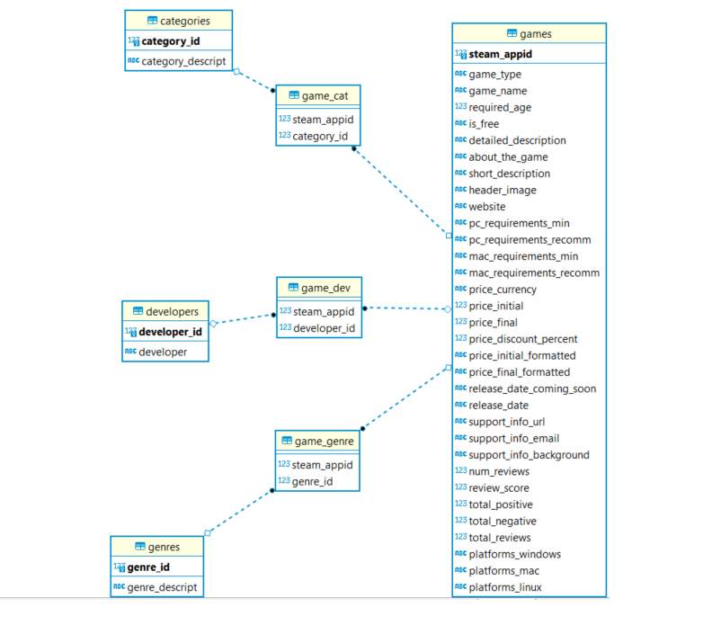

# Anomalous Sound Detection for predictive maintenance of industrial machines

## Table of Contents
1. [Description](#description)
1. [Objectives](#objectives)
	1. [Challenges](#challenges)
	2. [Limitations](#limitations)
	3. [Further developments](#further-developments)
1. [Repo Architecture](#repo-architecture)
1. [Installation](#installation)
1. [Usage](#usage)
1. [Visuals](#visuals)
1. [Timeline](#timeline)
1. [Personal situation](#personal-situation)

## Description
This project is a part of the Becode.org AI Bootcamp programme. The goal is to produce a supervised classifier for anomalous sound detection in industrial machines for a fictional company Acme Corporation. Data samples of normal and abnormal sounds of valves, pumps, fans and sliders are provided. 

## Objectives

- Be able to parse json files
- Be able to build and deploy an app using Flask, Docker, and Heroku
- Be able to save json data into an SQL database
- Be able to design a relational SQL database
- Be able to visualize data from a SQL database
- Be able to deploy said database alongside (interactive) visualizations

### Strengths

- Normalised SQL database
- Full pipeline:  JSON to SQL, data insights, Flask + HTML, Docker, Heroku.

### Limitations

- Not all data normalised. 
- 

### Further Developments

- Creating more columns in the database.
- Performing more insights.
- Creating interactive dashboard.

## Repo Architecture

- *(1) README.md* Project documentation
- *(2) 
- *(3) 
- *(4) 
- *(5)  
- *(6) 
- *(7) 

## Installation

 *git clone* the repo 

## Usage

## Visuals

## Timeline

The project took 10 working days.

## Personal situation

[kpranke](https://github.com/kpranke)

I am currently participating in the Becode.org AI Bootcamp to upskill into a career in data science.

**[Back to top](#table-of-contents)**