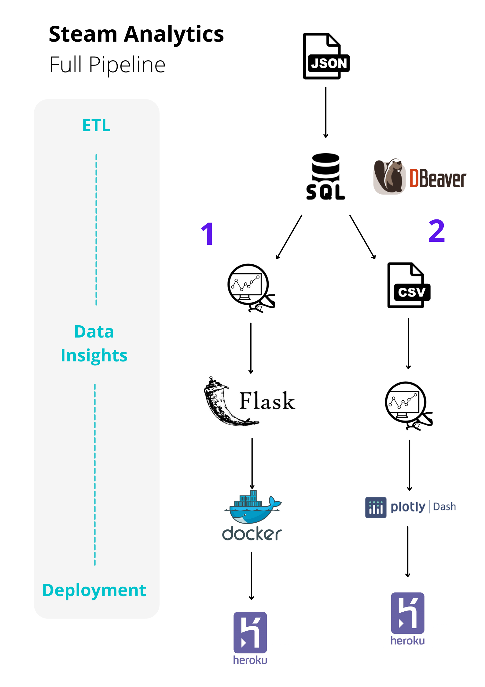

# Steam Games Analytics - Which Games Are the Most Profitable (BeCode Deployment Challenge)

## Table of Contents
1. [Description](#description)
1. [Objectives](#objectives)
	1. [Challenges](#challenges)
	2. [Limitations](#limitations)
	3. [Further developments](#further-developments)
1. [Repo Architecture](#repo-architecture)
1. [Installation](#installation)
1. [Usage](#usage)
1. [Visuals](#visuals)
1. [Timeline](#timeline)
1. [Personal situation](#personal-situation)

## Description
This project is a part of the Becode.org AI Bootcamp programme. The goal is to to create a dashboard with insights about games on Steam platform based on scraped data provided in JSON format (see in the repo: database.txt). The dashboard should be deployed with Flask, Docker and Heroku. The project is ended with presenting the data insights to the client.

## Objectives

- Be able to parse JSON files
- Be able to build and deploy an app using Flask, Docker, and Heroku
- Be able to save json data into an SQL database
- Be able to design a relational SQL database
- Be able to visualize data from a SQL database
- Be able to deploy said database alongside (interactive) visualizations

### Strengths

- Normalised SQL database (See: the ER diagram below)
- Implemented the full pipeline:  JSON to SQL, data insights, Flask + HTML, Docker, Heroku.

### Limitations

- Not all data was transformed to a normalised database, which limits potential insights.
- Not all columns are added to the Flask app.
- Flask app is displaying stativ visuals with insights. They are not interactive.

### Further Developments

- Creating more columns in the database and adding all the data in a normalized format.
- Accessing more columns wit the Flask app.
- Performing more insights.
- Creating an interactive dashboard with Dash.

## Repo Architecture

1. **/img** - folder contains images: an ER diagram of the existing SQL database and suggested data pipelines (1 - implemented, 2 - work in progress; in a separate repo)
1. **/static** - folder contains images used in the app
1. **/templates** - folder contains .html file used for the app layout
1. **README.md*** - project documentation
1. **Dockerfile**  - Docker file
1. **ETL.ipynb** - Python notebook contains code necessary to extract data from json and load it to SQL database
1. **Insights.ipynb** - Python notebook contains data insights along with graphs which can be saved to .png
1. **Procfile** - a procfile, which is required to deply with Heroku
1. **app.py** - app written in Flask, which connects to the .db and displays visuals and table columns
1. **database.txt** - a text file in which data from Steam is stored (in JSON format)
1. **requirements.txt** - a text file with a list of libraries required to run the app
1. **runtime.txt** - a text file which sets the correct version of Python in which app runs.
1. **steam_games.db** - a generated SQL database with normalized tables (a prototype - does not contain all the initial data). See visuals for the ER diagram of the database structure.
1. **STEAM ANALYTICS.pdf** - a presentation with the insights

## Installation

 *git clone* the repo 

## Usage
1. Access the app online: https://steam-analytics-kasia-docker.herokuapp.com/
1. Or: to run the app in your local environment, open a command line and run `python app.py`.
1. Or: to generate more insights use, `Insights.ipynb` jupyter notebook. In case you'd like to incorporate more visuals to the app, you need to add them to `app.py`.
1. Or: to add more data to the SQL database, use `ETL.ipynb`, where you can create more columns (see the exisiting ones on the ER diagram in the *Visuals* section of this `README.md` file
**Note:** I used the following SQL client to display the created database and automatically create the ER diagram: [DBeaver](https://dbeaver.io/)

## Visuals

## Timeline

The project took 10 working days.

## Personal situation

I am currently participating in the Becode.org AI Bootcamp to upskill into a career in data science. My primary interest is in language as well as environmental issues.

Feel free to reach me on LinkedIn: [kpranke](https://github.com/kpranke)

**[Back to top](#table-of-contents)**
